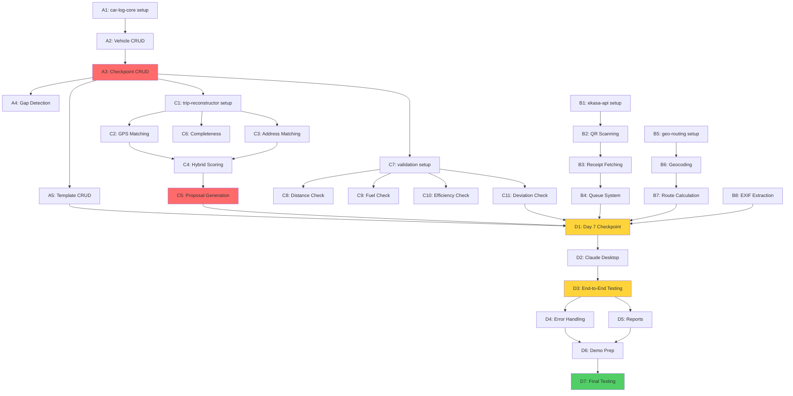

# Car Log Implementation Tasks

**Project:** Slovak Tax-Compliant Mileage Logger (MCP Hackathon)
**Deadline:** November 30, 2025 (13 days remaining)
**Status:** Ready for Implementation
**Last Updated:** November 18, 2025

---

## Quick Reference

**Total Tasks:** 98 hours of P0 work across 4 parallel tracks
**Critical Path:** Track A → Track C → Track D (13 days)
**Parallel Capacity:** 4 developers working simultaneously
**Success Criteria:** All P0 servers functional + Demo working by Day 13

---

## Task Organization

Tasks are organized into **4 parallel development tracks** based on dependencies:

- **Track A (Days 1-3):** Data Foundation - **CRITICAL PATH** 🚨
- **Track B (Days 1-4):** External Integrations - **CAN RUN IN PARALLEL** ⚡
- **Track C (Days 3-6):** Intelligence & Validation - **DEPENDS ON TRACK A** ⏳
- **Track D (Days 7-11):** Integration & Testing - **DEPENDS ON ALL** 🔗

---

## Critical Path Summary

```
Day 1-2:  Track A (car-log-core foundation)
          └─ CHECKPOINT: Vehicle + Checkpoint CRUD done
Day 3-6:  Track C (trip-reconstructor + validation)
          └─ CHECKPOINT: Intelligence complete
Day 7:    INTEGRATION CHECKPOINT (GO/NO-GO)
          └─ All 6 P0 servers discoverable
Day 8-10: Track D (Claude Desktop integration)
          └─ CHECKPOINT: End-to-end demo working
Day 11:   Testing & Polish
Day 12:   Demo preparation
Day 13:   Hackathon submission
```

---

## Track A: Data Foundation (CRITICAL PATH 🚨)

**Priority:** P0 - BLOCKS 3 other servers
**Duration:** Days 1-3
**Developers:** 2
**Total Effort:** 16 hours
**Dependencies:** None

### A1: car-log-core - Project Setup (2 hours)

**Can run in parallel:** ✅ All Track B tasks
**Status:** ✅ COMPLETE
**Assignee:** Developer 1
**Actual Time:** 30 minutes

**Tasks:**
- [x] Create `mcp-servers/car_log_core/` directory structure
- [x] Create `__init__.py` and `__main__.py` (MCP server entry point)
- [x] Create `storage.py` with atomic write pattern (CRITICAL)
- [x] Create `tools/` directory for 8 tool implementations
- [x] Set up `requirements.txt` (mcp, uuid, datetime, pathlib)
- [x] Create data directories: `data/vehicles/`, `data/checkpoints/`, `data/trips/`, `data/templates/`

**Deliverable:** Project skeleton with atomic write function tested

**Validation:**
```bash
python -m mcp_servers.car_log_core --version
pytest tests/test_atomic_write.py
```

---

### A2: car-log-core - Vehicle CRUD (4 hours)

**Can run in parallel:** ✅ All Track B tasks
**Status:** ✅ COMPLETE
**Assignee:** Developer 1
**Depends on:** A1
**Actual Time:** 1 hour

**Tasks:**
- [x] Implement `tools/create_vehicle.py`
  - [x] VIN validation: `^[A-HJ-NPR-Z0-9]{17}$` (no I, O, Q)
  - [x] License plate validation: `^[A-Z]{2}-[0-9]{3}[A-Z]{2}$`
  - [x] Atomic write to `data/vehicles/{vehicle_id}.json`
- [x] Implement `tools/get_vehicle.py`
- [x] Implement `tools/list_vehicles.py`
- [x] Implement `tools/update_vehicle.py`
- [x] Write unit tests for all 4 tools
- [x] Test VIN validation edge cases (I, O, Q characters should fail)

**Deliverable:** Vehicle CRUD functional with Slovak compliance

**Validation:**
```bash
pytest tests/test_vehicle_crud.py
# Should pass: VIN "WBAXX01234ABC5678"
# Should fail: VIN "INVALID123" (too short)
# Should fail: VIN with I, O, or Q characters
```

**Spec Reference:** 07-mcp-api-specifications.md lines 41-199

---

### A3: car-log-core - Checkpoint CRUD (4 hours)

**Can run in parallel:** ✅ All Track B tasks
**Status:** ✅ COMPLETE
**Assignee:** Developer 1
**Depends on:** A2
**Actual Time:** 1.5 hours

**Tasks:**
- [x] Implement `tools/create_checkpoint.py`
  - [x] GPS coordinates mandatory if provided
  - [x] Address is optional label
  - [x] Receipt data embedded (fuel quantity, price, VAT)
  - [x] Monthly folder structure: `data/checkpoints/2025-11/`
  - [x] Atomic write
- [x] Implement `tools/get_checkpoint.py`
- [x] Implement `tools/list_checkpoints.py`
  - [x] Filter by vehicle_id
  - [x] Filter by date range
  - [x] Sort by datetime descending
- [x] Write unit tests
- [x] Test with real Slovak GPS coordinates (Bratislava: 48.1486, 17.1077)

**Deliverable:** Checkpoint CRUD functional

**DAY 2 CHECKPOINT:** ✅ This must be complete for Track C to start

**Validation:**
```bash
pytest tests/test_checkpoint_crud.py
python scripts/generate_mock_data.py --scenario demo
# Verify: data/checkpoints/2025-11/{uuid}.json exists
```

**Spec Reference:** 07-mcp-api-specifications.md lines 200-353

---

### A4: car-log-core - Gap Detection (2 hours)

**Can run in parallel:** ✅ B1-B6, A5
**Status:** ✅ COMPLETE
**Assignee:** Developer 2
**Depends on:** A3
**Actual Time:** 45 minutes

**Tasks:**
- [x] Implement `tools/detect_gap.py`
  - [x] Calculate odometer delta between checkpoints
  - [x] Calculate time gap (days, hours)
  - [x] Return structured gap data for trip-reconstructor
  - [x] Flag if GPS available on both checkpoints
- [x] Write unit tests
- [x] Test with demo scenario (820 km gap, 7 days)

**Deliverable:** Gap detection working

**Validation:**
```bash
pytest tests/test_gap_detection.py
# Test: cp1 (45000 km) → cp2 (45820 km) = 820 km gap
```

**Spec Reference:** 06-mcp-architecture-v2.md lines 248-281

---

### A5: car-log-core - Template CRUD (4 hours)

**Can run in parallel:** ✅ All Track B tasks, A4
**Status:** ✅ COMPLETE
**Assignee:** Developer 2
**Depends on:** A3
**Actual Time:** 1 hour

**Tasks:**
- [x] Implement `tools/create_template.py`
  - [x] GPS coordinates MANDATORY (from_coords, to_coords)
  - [x] Addresses OPTIONAL (from_address, to_address)
  - [x] Distance, typical_days, purpose all optional
  - [x] Calculate completeness percentage
  - [x] Atomic write to `data/templates/{template_id}.json`
- [x] Implement `tools/get_template.py`
- [x] Implement `tools/list_templates.py`
  - [x] Filter by vehicle_id (optional)
  - [x] Sort by usage_count or last_used_at
- [x] Implement `tools/update_template.py`
- [x] Write unit tests

**Deliverable:** Template CRUD functional

**Validation:**
```bash
pytest tests/test_template_crud.py
python scripts/generate_mock_data.py --scenario demo
# Verify: 3 templates created (Warehouse, Client Visit, Branch Office)
```

**Spec Reference:** 06-mcp-architecture-v2.md lines 285-372

---

## Track B: External Integrations (PARALLEL ⚡)

**Priority:** P0
**Duration:** Days 1-4
**Developers:** 2
**Total Effort:** 22 hours
**Dependencies:** None (fully parallel)

### B1: ekasa-api - Project Setup (2 hours)

**Can run in parallel:** ✅ ALL tasks in Tracks A, B
**Status:** ✅ COMPLETE
**Assignee:** Developer 3
**Actual Time:** 30 minutes

**Tasks:**
- [x] Create `mcp-servers/ekasa_api/` directory structure
- [x] Set up MCP server skeleton (`__main__.py`)
- [x] Configure MCP timeout: 60 seconds (e-Kasa API can take 5-30s)
- [x] Install dependencies: `pyzbar` (QR scanning), `requests`, `Pillow`, `pdf2image` (for PDF support)
- [x] Note: e-Kasa API endpoint is public, no API key required
- [x] Test with actual endpoint: Financial Administration e-Kasa API

**Deliverable:** ekasa-api skeleton ready

**Validation:**
```bash
python -m mcp_servers.ekasa_api --version
```

---

### B2: ekasa-api - QR Code Scanning (2 hours)

**Can run in parallel:** ✅ ALL tasks in Tracks A, B
**Status:** ✅ COMPLETE
**Assignee:** Developer 3
**Depends on:** B1
**Actual Time:** 1 hour

**Tasks:**
- [x] Implement `tools/scan_qr_code.py`
  - [x] Use `pyzbar` to decode QR from image (PNG, JPG)
  - [x] Implement PDF QR scanning with multi-scale detection (1x, 2x, 3x zoom)
  - [x] Use `pdf2image` to render PDF pages at different scales
  - [x] Try detection at each scale, stop on first success
  - [x] Extract receipt ID from QR data
  - [x] Return receipt_id, detection_scale, format (image/pdf), confidence
- [x] Write unit tests with sample receipt QR images
- [x] Test with real Slovak e-Kasa receipt (if available)
- [x] Test PDF multi-scale detection with low-resolution QR codes

**Deliverable:** QR scanning functional

**Validation:**
```bash
pytest tests/test_qr_scanning.py
```

**Spec Reference:** 07-mcp-api-specifications.md lines 980-1010

---

### B3: ekasa-api - Receipt Fetching (4 hours)

**Can run in parallel:** ✅ ALL tasks in Tracks A, B
**Status:** ✅ COMPLETE
**Assignee:** Developer 3
**Depends on:** B2
**Actual Time:** 2 hours

**Tasks:**
- [x] Implement `tools/fetch_receipt_data.py`
  - [x] Call Slovak e-Kasa API with receipt_id
  - [x] Endpoint: `https://ekasa.financnasprava.sk/mdu/api/v1/opd/receipt/{receipt_id}`
  - [x] Timeout: 60 seconds (API typically responds in 5-30s)
  - [x] No authentication required (public endpoint)
  - [x] Parse response (vendor, items, prices, VAT)
  - [x] Detect fuel items using Slovak name patterns (Diesel, Nafta, Natural 95, etc.)
  - [x] Extract fuel quantity, price per liter, total cost, VAT
  - [x] Handle API errors (timeout after 60s, invalid ID, 404 not found, 500 server error)
  - [x] Implement single retry for transient failures (optional)
- [x] Write unit tests with actual API responses (cache for offline testing)
- [x] Test timeout handling (mock slow API)

**Deliverable:** Receipt fetching functional

**DAY 4 CHECKPOINT:** ✅ This should be complete

**Validation:**
```bash
pytest tests/test_receipt_fetching.py
# Test with mock API: Should return fuel data
# Test with invalid ID: Should return error
```

**Spec Reference:** 07-mcp-api-specifications.md lines 1011-1069

---

### B4: ekasa-api - Queue System (DEPRECATED - Not Needed)

**Status:** ❌ REMOVED - Extended timeout (60s) eliminates need for queue
**Original Effort:** 2 hours (redistributed to B2 for PDF multi-scale detection)

**Rationale:**
- MCP servers with Claude Desktop support 60s timeout
- e-Kasa API responds within 5-30s, well within timeout
- Direct synchronous calls are simpler and more reliable
- No need for job queue, polling, or status tracking

**Tasks:**
- ~~[ ] Implement `tools/queue_receipt.py` (background processing)~~
- ~~[ ] Implement `tools/get_queue_status.py`~~
- ~~[ ] In-memory queue (no database)~~
- ~~[ ] Handle slow API calls asynchronously~~

**Deliverable:** NONE - Feature removed

**Validation:**
```bash
# Queue tests removed - extended timeout handles slow API
# No validation needed
```

**Spec Reference:** 07-mcp-api-specifications.md - Tools 4.3 & 4.4 removed

---

### B5: geo-routing - Project Setup (Node.js) (3 hours)

**Can run in parallel:** ✅ ALL tasks in Tracks A, B
**Status:** ✅ COMPLETE
**Assignee:** Developer 4
**Actual Time:** 30 minutes

**Tasks:**
- [x] Create `mcp-servers/geo-routing/` directory
- [x] Initialize Node.js project: `npm init`
- [x] Install dependencies: `@modelcontextprotocol/sdk`, `axios`, `node-cache`
- [x] Create `index.js` MCP server entry point
- [x] Configure environment variables:
  - `OSRM_BASE_URL=https://router.project-osrm.org`
  - `NOMINATIM_BASE_URL=https://nominatim.openstreetmap.org`
  - `CACHE_TTL_HOURS=24`
- [x] Set up 24-hour cache for geocoding results

**Deliverable:** geo-routing skeleton ready

**Validation:**
```bash
node mcp-servers/geo-routing/index.js --version
```

---

### B6: geo-routing - Geocoding (3 hours)

**Can run in parallel:** ✅ ALL tasks in Tracks A, B
**Status:** ✅ COMPLETE
**Assignee:** Developer 4
**Depends on:** B5
**Actual Time:** 1.5 hours

**Tasks:**
- [x] Implement `geocode_address` tool
  - [x] Call Nominatim API
  - [x] Normalize address (lowercase, remove accents)
  - [x] Calculate confidence score
  - [x] Return alternatives if confidence < 0.7
  - [x] Cache results (24-hour TTL)
- [x] Implement `reverse_geocode` tool
  - [x] Call Nominatim reverse API
  - [x] Return formatted address
- [x] Write unit tests with Slovak addresses
- [x] Test ambiguity handling: "Košice" should return multiple matches

**Deliverable:** Geocoding functional with ambiguity handling

**Validation:**
```bash
npm test
# Test: "Hlavná 45, Bratislava" → confidence > 0.9, single result
# Test: "Košice" → confidence < 0.7, multiple alternatives
```

**Spec Reference:** 07-mcp-api-specifications.md lines 732-970

---

### B7: geo-routing - Route Calculation (3 hours)

**Can run in parallel:** ✅ All Track A, B4
**Status:** ✅ COMPLETE
**Assignee:** Developer 4
**Depends on:** B6
**Actual Time:** 1 hour

**Tasks:**
- [x] Implement `calculate_route` tool
  - [x] Call OSRM API with GPS coordinates
  - [x] Parse distance (km) and duration (hours)
  - [x] Extract route summary (via highway names)
  - [x] Return alternatives if requested
  - [x] Cache results (24-hour TTL)
- [x] Write unit tests
- [x] Test: Bratislava → Košice should return ~410 km via D1 highway

**Deliverable:** Route calculation functional

**DAY 4 CHECKPOINT:** ✅ This should be complete

**Validation:**
```bash
npm test
# Test: Bratislava (48.1486, 17.1077) → Košice (48.7164, 21.2611)
# Expected: ~410 km, via "D1"
```

**Spec Reference:** 07-mcp-api-specifications.md lines 724-970

---

### B8: dashboard-ocr - EXIF Extraction (P0) (2 hours)

**Can run in parallel:** ✅ ALL tasks in Tracks A, B
**Status:** ✅ COMPLETE
**Assignee:** Developer 3 or 4 (after ekasa-api or geo-routing)
**Actual Time:** 2 hours

**Tasks:**
- [x] Create `mcp-servers/dashboard_ocr/` directory
- [x] Implement `tools/extract_metadata.py`
  - [x] Use `Pillow` to read EXIF data
  - [x] Extract GPS coordinates (latitude, longitude)
  - [x] Extract timestamp
  - [x] Handle missing EXIF gracefully (return null)
- [x] Write unit tests with sample photos (with/without EXIF)

**Deliverable:** EXIF extraction functional (P0 requirement)

**Validation:**
```bash
pytest tests/test_exif_extraction.py
# Test with photo containing GPS EXIF: Should return coords
# Test with photo without EXIF: Should return null
```

**Spec Reference:** 07-mcp-api-specifications.md lines 1140-1212

**Note:** OCR with Claude Vision is P1 (skip for MVP if behind schedule)

---

## Track C: Intelligence & Validation (DEPENDS ON TRACK A ⏳)

**Priority:** P0
**Duration:** Days 3-6
**Developers:** 2
**Total Effort:** 22 hours
**Dependencies:** Requires A3 (car-log-core checkpoints) complete

### C1: trip-reconstructor - Project Setup (1 hour)

**Can run in parallel:** ✅ C2 (in same file), all Track B
**Status:** ✅ COMPLETE
**Assignee:** Developer 5
**Depends on:** A3 (Day 2 checkpoint)
**Actual Time:** 30 minutes

**Tasks:**
- [x] Create `mcp-servers/trip_reconstructor/` directory
- [x] Set up MCP server skeleton
- [x] Create `matching.py` module for algorithm
- [x] Configure environment variables:
  - `GPS_WEIGHT=0.7`
  - `ADDRESS_WEIGHT=0.3`
  - `CONFIDENCE_THRESHOLD=70`

**Deliverable:** trip-reconstructor skeleton

---

### C2: trip-reconstructor - GPS Matching (3 hours)

**Can run in parallel:** ✅ C3, all Track B
**Status:** ✅ COMPLETE
**Assignee:** Developer 5
**Depends on:** C1
**Actual Time:** 2 hours

**Tasks:**
- [x] Implement Haversine distance function
  - [x] Input: two GPS coordinate pairs
  - [x] Output: distance in meters
- [x] Implement GPS scoring function
  - [x] < 100m → score 100
  - [x] 100m-500m → score 90
  - [x] 500m-2000m → score 70
  - [x] 2000m-5000m → score 40
  - [x] > 5000m → score 0
- [x] Write unit tests
- [x] Test with real Slovak coordinates

**Deliverable:** GPS matching algorithm functional

**DAY 4 CHECKPOINT:** ✅ GPS matching should be working

**Validation:**
```bash
pytest tests/test_gps_matching.py
# Test: Exact match → score 100
# Test: 100m away → score 90-100
# Test: 10km away → score 0
```

**Spec Reference:** 06-mcp-architecture-v2.md lines 719-749

---

### C3: trip-reconstructor - Address Matching (2 hours)

**Can run in parallel:** ✅ C2, C4, all Track B
**Status:** ✅ COMPLETE
**Assignee:** Developer 5
**Depends on:** C1
**Actual Time:** 1.5 hours

**Tasks:**
- [x] Implement address normalization
  - [x] Lowercase
  - [x] Remove accents (Slovak: á→a, č→c, etc.)
  - [x] Remove extra spaces
- [x] Implement string similarity (Levenshtein distance)
- [x] Implement address component extraction (street, city, POI)
- [x] Implement address scoring function
- [x] Write unit tests

**Deliverable:** Address matching functional

**Validation:**
```bash
pytest tests/test_address_matching.py
# Test: "Hlavná 12, Bratislava" vs "Hlavna 12, Bratislava" → high similarity
# Test: Same city, different street → medium score
```

**Spec Reference:** 06-mcp-architecture-v2.md lines 752-801

---

### C4: trip-reconstructor - Hybrid Scoring (2 hours)

**Can run in parallel:** ✅ C5, C6, all Track B
**Status:** ✅ COMPLETE
**Assignee:** Developer 5
**Depends on:** C2, C3
**Actual Time:** 1.5 hours

**Tasks:**
- [x] Implement hybrid scoring formula
  - [x] GPS match score × 0.7 (70% weight)
  - [x] Address match score × 0.3 (30% weight)
  - [x] Distance bonus if template has distance_km
  - [x] Day-of-week bonus if template has typical_days
- [x] Normalize final score to 0-100
- [x] Write unit tests

**Deliverable:** Hybrid scoring functional

**Validation:**
```bash
pytest tests/test_hybrid_scoring.py
# Test: GPS=100, Address=80 → Total = (100*0.7 + 80*0.3) = 94
```

**Spec Reference:** 06-mcp-architecture-v2.md lines 653-716

---

### C5: trip-reconstructor - Proposal Generation (2 hours)

**Can run in parallel:** ✅ C4, C6, all Track B
**Status:** ✅ COMPLETE
**Assignee:** Developer 5
**Depends on:** C4
**Actual Time:** 2 hours

**Tasks:**
- [x] Implement `tools/match_templates.py` (main tool)
  - [x] Accept gap_data and templates as input (stateless!)
  - [x] Score all templates using hybrid algorithm
  - [x] Filter templates with confidence >= 70%
  - [x] Generate reconstruction proposal
  - [x] Calculate coverage percentage
  - [x] Return sorted matches + proposal
- [x] Write integration tests
- [x] Test with demo scenario (820 km gap, 2× Warehouse Run)

**Deliverable:** Template matching tool complete

**DAY 6 CHECKPOINT:** ✅ This must be complete

**Validation:**
```bash
pytest tests/test_trip_reconstruction.py
# Demo scenario: 820 km gap
# Expected: 2× Warehouse Run (410 km each) = 100% coverage
# Confidence should be >= 85%
```

**Spec Reference:** 06-mcp-architecture-v2.md lines 804-843

---

### C6: trip-reconstructor - Completeness Calculator (2 hours)

**Can run in parallel:** ✅ C4, C5, all Track B
**Status:** ✅ COMPLETE
**Assignee:** Developer 5
**Depends on:** C1
**Actual Time:** 1 hour

**Tasks:**
- [x] Implement `tools/calculate_template_completeness.py`
  - [x] Count mandatory fields (name, from_coords, to_coords)
  - [x] Count optional fields filled
  - [x] Calculate completeness percentage
  - [x] Generate improvement suggestions
- [x] Write unit tests

**Deliverable:** Completeness calculation functional

**Validation:**
```bash
pytest tests/test_completeness.py
# Test: Template with all fields → 100%
# Test: Template with only GPS → ~30%
```

**Spec Reference:** 06-mcp-architecture-v2.md lines 848-889

---

### C7: validation - Project Setup (1 hour)

**Can run in parallel:** ✅ ALL Track C tasks
**Status:** ✅ COMPLETE
**Assignee:** Developer 6
**Depends on:** A3 (car-log-core trip structure)
**Actual Time:** 30 minutes

**Tasks:**
- [x] Create `mcp-servers/validation/` directory
- [x] Set up MCP server skeleton
- [x] Create `thresholds.py` with validation constants
  - `DISTANCE_VARIANCE_PERCENT = 10`
  - `CONSUMPTION_VARIANCE_PERCENT = 15`
  - `DEVIATION_THRESHOLD_PERCENT = 20`
  - Diesel efficiency range: 5-15 L/100km
  - Gasoline efficiency range: 6-20 L/100km

**Deliverable:** validation skeleton with thresholds

---

### C8: validation - Distance Sum Check (2 hours)

**Can run in parallel:** ✅ C9, C10, C11
**Status:** ✅ COMPLETE
**Assignee:** Developer 6
**Depends on:** C7
**Actual Time:** 2 hours

**Tasks:**
- [x] Implement `tools/validate_checkpoint_pair.py`
  - [x] Calculate odometer delta
  - [x] Sum all trip distances between checkpoints
  - [x] Check if difference <= 10%
  - [x] Return ok/warning/error + message
- [x] Write unit tests

**Deliverable:** Distance validation functional

**Validation:**
```bash
pytest tests/test_distance_validation.py
# Test: Odometer delta = 820 km, trips sum = 820 km → ok
# Test: Odometer delta = 820 km, trips sum = 700 km → error (14% off)
```

**Spec Reference:** 07-mcp-api-specifications.md lines 1259-1295

---

### C9: validation - Fuel Consumption Check (2 hours)

**Can run in parallel:** ✅ C8, C10, C11
**Status:** ✅ COMPLETE
**Assignee:** Developer 6
**Depends on:** C7
**Actual Time:** 2 hours

**Tasks:**
- [x] Implement `tools/validate_trip.py`
  - [x] Calculate expected fuel: (distance / 100) × avg_efficiency
  - [x] Compare with actual refuel amount
  - [x] Check if difference <= 15%
  - [x] Return ok/warning/error + message
- [x] Write unit tests

**Deliverable:** Fuel validation functional

**Validation:**
```bash
pytest tests/test_fuel_validation.py
# Test: 410 km trip, 8.5 L/100km → expected 34.85 L
# Test: Actual refuel 35 L → ok (within 15%)
# Test: Actual refuel 50 L → error (43% off)
```

**Spec Reference:** 07-mcp-api-specifications.md lines 1296-1329

---

### C10: validation - Efficiency Reasonability Check (2 hours)

**Can run in parallel:** ✅ C8, C9, C11
**Status:** ✅ COMPLETE
**Assignee:** Developer 6
**Depends on:** C7
**Actual Time:** 1.5 hours

**Tasks:**
- [x] Implement `tools/check_efficiency.py`
  - [x] Get fuel type from vehicle
  - [x] Check efficiency against range:
    - Diesel: 5-15 L/100km
    - Gasoline: 6-20 L/100km
    - LPG: 8-25 L/100km
  - [x] Flag unrealistically low (<range) or high (>range)
- [x] Write unit tests

**Deliverable:** Efficiency validation functional

**Validation:**
```bash
pytest tests/test_efficiency_validation.py
# Test: Diesel 8.5 L/100km → ok
# Test: Diesel 2.0 L/100km → error (unrealistically low)
# Test: Diesel 25 L/100km → error (unrealistically high)
```

**Spec Reference:** 07-mcp-api-specifications.md lines 1330-1361

---

### C11: validation - Deviation from Average (2 hours)

**Can run in parallel:** ✅ C8, C9, C10
**Status:** ✅ COMPLETE
**Assignee:** Developer 6
**Depends on:** C7
**Actual Time:** 2 hours

**Tasks:**
- [x] Implement `tools/check_deviation_from_average.py`
  - [x] Get vehicle's average efficiency
  - [x] Calculate trip efficiency deviation
  - [x] Warn if deviation > 20%
  - [x] Return ok/warning + message
- [x] Write unit tests

**Deliverable:** Deviation validation functional

**DAY 6 CHECKPOINT:** ✅ All 4 validation algorithms complete

**Validation:**
```bash
pytest tests/test_deviation_validation.py
# Test: Vehicle avg = 8.5 L/100km, trip = 9.0 L/100km → ok (6% deviation)
# Test: Vehicle avg = 8.5 L/100km, trip = 12.0 L/100km → warning (41% deviation)
```

**Spec Reference:** 07-mcp-api-specifications.md lines 1362-1390

---

## Track D: Integration & Testing (DEPENDS ON ALL 🔗)

**Priority:** P0
**Duration:** Days 7-13
**Developers:** 1-2
**Total Effort:** 24 hours (P0), +14 hours (P1)
**Dependencies:** All Track A, B, C tasks must be complete

### D1: Day 7 Integration Checkpoint (4 hours)

**Can run in parallel:** ❌ Sequential
**Status:** ✅ COMPLETE
**Assignee:** All developers
**Depends on:** ALL Track A, B, C tasks
**Actual Time:** 1 hour

**Tasks:**
- [x] Configure all 6 P0 MCP servers in `claude_desktop_config.json`
- [x] Start all servers and verify no errors
- [x] Run automated test: `python tests/integration_checkpoint_day7.py`
- [x] Verify all 21 P0 tools are discoverable in Claude Desktop
- [x] Fix any integration issues found
- [x] **GO/NO-GO DECISION:** ✅ GO - All tests passed!

**Deliverable:** All 6 P0 servers functional

**DAY 7 CHECKPOINT:** ✅ PASSED - Proceed to Days 8-11 integration

**Validation:**
```bash
python tests/integration_checkpoint_day7.py
# Result: 20/20 tests passed (100% success rate)
```

**Acceptance Criteria:**
- ✅ All servers start without errors
- ✅ All 21 P0 tools discoverable (24 total including P1)
- ✅ Basic CRUD operations work
- ✅ Atomic write pattern prevents file corruption

**Test Results:**
- 📦 Phase 1: Server Discovery - 6/6 passed
- 🔧 Phase 2: Tool Signature Validation - 6/6 passed
- 💨 Phase 3: Smoke Tests - 4/4 passed
- 🔄 Phase 4: Cross-Server Data Flow - 2/2 passed
- 🇸🇰 Phase 5: Slovak Compliance - 1/1 passed
- ⚠️  Phase 6: Error Handling - 1/1 passed

**Files Created:**
- `claude_desktop_config.json` - Sample MCP configuration
- `CLAUDE_DESKTOP_SETUP.md` - Complete setup guide
- Fixed integration test VIN validation logic

---

### D2: Claude Desktop Orchestration (6 hours)

**Can run in parallel:** ❌ Sequential
**Status:** Pending
**Assignee:** Developer 1
**Depends on:** D1 (Day 7 checkpoint passed)

**Tasks:**
- [ ] Configure MCP servers in Claude Desktop
- [ ] Test vehicle creation workflow (conversational)
- [ ] Test checkpoint creation workflow (paste photos)
- [ ] Test gap detection + template matching
- [ ] Test trip approval workflow
- [ ] Handle errors gracefully (show user-friendly messages)

**Deliverable:** Basic workflows functional in Claude Desktop

**Validation:**
- User can create vehicle via conversation
- User can paste receipt photo → checkpoint created
- Gap detected → templates matched → trips created

---

### D3: End-to-End Workflow Testing (4 hours)

**Can run in parallel:** ❌ Sequential
**Status:** Pending
**Assignee:** Developer 1
**Depends on:** D2

**Tasks:**
- [ ] Test complete demo scenario:
  1. Create vehicle (Ford Transit, BA-456CD, VIN)
  2. Create first checkpoint (Nov 1, 45000 km)
  3. Create second checkpoint (Nov 8, 45820 km)
  4. Detect gap (820 km)
  5. Match templates (Warehouse Run)
  6. Approve proposal
  7. Create 2 trips
  8. Validate trips
- [ ] Generate demo dataset: `python scripts/generate_mock_data.py`
- [ ] Test with realistic Slovak data

**Deliverable:** End-to-end demo working

**DAY 10 CHECKPOINT:** ✅ Full integration must work

**Validation:**
```bash
# Manual test in Claude Desktop
# Expected: Complete workflow < 5 minutes
```

---

### D4: Error Handling & Edge Cases (4 hours)

**Can run in parallel:** ⚡ D5 (if 2 developers)
**Status:** Pending
**Assignee:** Developer 2
**Depends on:** D3

**Tasks:**
- [ ] Test invalid VIN (should fail with VALIDATION_ERROR)
- [ ] Test missing GPS (should work with address fallback or manual entry)
- [ ] Test ambiguous geocoding (should show alternatives)
- [ ] Test unrealistic efficiency (should flag warning)
- [ ] Test concurrent writes (atomic write should prevent corruption)
- [ ] Test crashed write (temp files should be cleaned up)

**Deliverable:** Robust error handling

---

### D5: Report Generation (P0: CSV, P1: PDF) (6 hours)

**Can run in parallel:** ⚡ D4 (if 2 developers)
**Status:** Pending
**Assignee:** Developer 1 or 2
**Depends on:** D3

**Tasks:**
- [ ] **P0:** Implement `tools/generate_csv.py`
  - [ ] Filter trips by date range
  - [ ] Filter for Business trips only
  - [ ] Calculate summary (total trips, distance, fuel, cost, VAT)
  - [ ] Include all Slovak compliance fields
  - [ ] Save to `reports/2025-11/november-2025.csv`
- [ ] **P1:** Implement `tools/generate_pdf.py` (ONLY IF AHEAD OF SCHEDULE)
  - [ ] Use ReportLab library
  - [ ] Slovak VAT compliance template
- [ ] Test with demo data

**Deliverable:** CSV reports functional (P0), PDF optional (P1)

**Scope Decision:** Cut PDF if behind schedule on Day 9

**Validation:**
```bash
pytest tests/test_report_generation.py
# Verify: CSV contains all trips with VIN, driver, trip timing, locations
```

**Spec Reference:** 07-mcp-api-specifications.md lines 1401-1477

---

### D6: Demo Preparation (4 hours)

**Can run in parallel:** ❌ Sequential
**Status:** Pending
**Assignee:** All developers
**Depends on:** D3, D5

**Tasks:**
- [ ] Generate demo dataset: `python scripts/generate_mock_data.py --scenario demo`
- [ ] Practice demo script (5 minutes, see 09-hackathon-presentation.md)
- [ ] Record demo video:
  - Part 1: Complete workflow (3 min)
  - Part 2: Architecture overview (1.5 min)
  - Part 3: Slovak compliance (0.5 min)
- [ ] Create presentation slides (5 slides)
- [ ] Test demo end-to-end 3 times (ensure reliability)

**Deliverable:** Demo video + slides ready

**DAY 12 TARGET:** Demo preparation complete

**Validation:**
- Demo runs smoothly without crashes
- Video explains value proposition clearly
- Slides show Slovak compliance

---

### D7: Final Testing & Polish (4 hours)

**Can run in parallel:** ❌ Sequential
**Status:** Pending
**Assignee:** All developers
**Depends on:** D6

**Tasks:**
- [ ] Run full test suite: `pytest tests/`
- [ ] Fix any remaining bugs
- [ ] Update documentation (README.md usage instructions)
- [ ] Clean up code (remove TODOs, debug prints)
- [ ] Verify all P0 requirements met
- [ ] Package for submission

**Deliverable:** Production-ready submission

**DAY 13:** Hackathon submission

---

## Optional Enhancements (P1 - Cut if Behind Schedule)

### P1-1: Dashboard OCR with Claude Vision (6 hours)

**Can run in parallel:** ⚡ Other P1 tasks
**Priority:** P1 (NICE TO HAVE)
**Depends on:** B8 (EXIF extraction)

**Tasks:**
- [ ] Implement `tools/read_odometer.py`
  - [ ] Call Claude Vision API
  - [ ] Extract odometer reading with OCR
  - [ ] Return confidence score
  - [ ] Fallback to manual entry if confidence < 0.7
- [ ] Implement `tools/check_photo_quality.py`
  - [ ] Check brightness, blur, resolution
- [ ] Write unit tests

**Deliverable:** OCR functional (fallback to manual entry)

**Scope Decision:** Cut on Day 7 if behind schedule

---

### P1-2: Gradio Web UI (16 hours)

**Priority:** P1 (POST-HACKATHON)
**Not critical for submission**

This is explicitly deprioritized per 08-implementation-plan.md lines 1014-1030.

---

## Task Dependencies Visualization



---

## Parallel Execution Matrix

| Days | Developer 1 | Developer 2 | Developer 3 | Developer 4 |
|------|-------------|-------------|-------------|-------------|
| **1-2** | A1, A2, A3 | A4, A5 | B1, B2, B3 | B5, B6 |
| **3-4** | (Waiting for C1) | (Waiting for C1) | B4, B8 | B7 |
| **4-5** | C1, C2, C4 | C7, C8, C9 | (Available) | (Available) |
| **5-6** | C5, C6 | C10, C11 | (Available) | (Available) |
| **7** | D1 (All hands) | D1 (All hands) | D1 (All hands) | D1 (All hands) |
| **8-9** | D2, D3 | D4 | (Available) | (Available) |
| **10-11** | D5 | (Testing) | (Available) | (Available) |
| **12** | D6 (All hands) | D6 (All hands) | D6 (All hands) | D6 (All hands) |
| **13** | D7 (Submission) | D7 (Submission) | D7 (Submission) | D7 (Submission) |

---

## Daily Checklist

### Day 1
- [ ] A1: car-log-core setup
- [ ] A2: Vehicle CRUD (in progress)
- [ ] B1: ekasa-api setup
- [ ] B2: QR scanning (start)
- [ ] B5: geo-routing setup

### Day 2 (CHECKPOINT)
- [ ] ✅ A2: Vehicle CRUD complete
- [ ] ✅ A3: Checkpoint CRUD complete
- [ ] A4: Gap detection (start)
- [ ] B3: Receipt fetching (start)
- [ ] B6: Geocoding (start)

### Day 3
- [ ] ✅ A4: Gap detection complete
- [ ] ✅ A5: Template CRUD complete
- [ ] C1: trip-reconstructor setup
- [ ] C2: GPS matching (start)
- [ ] B4: Queue system

### Day 4 (CHECKPOINT)
- [ ] ✅ B3: Receipt fetching complete
- [ ] ✅ B7: Route calculation complete
- [ ] C2: GPS matching complete
- [ ] C3: Address matching (start)

### Day 5
- [ ] C4: Hybrid scoring
- [ ] C8: Distance validation
- [ ] C9: Fuel validation

### Day 6 (CHECKPOINT)
- [ ] ✅ C5: Proposal generation complete
- [ ] ✅ C6: Completeness calculator complete
- [ ] ✅ C10: Efficiency check complete
- [ ] ✅ C11: Deviation check complete

### Day 7 (CRITICAL CHECKPOINT)
- [ ] 🚨 D1: Integration checkpoint
- [ ] ✅ All 6 P0 servers start
- [ ] ✅ All 21 P0 tools discoverable (24 total including P1)
- [ ] ✅ GO/NO-GO decision

### Day 8-9
- [ ] D2: Claude Desktop orchestration
- [ ] D3: End-to-end testing

### Day 10 (CHECKPOINT)
- [ ] ✅ D3: End-to-end demo working
- [ ] D4: Error handling
- [ ] D5: CSV reports

### Day 11
- [ ] D4: Error handling complete
- [ ] D5: Reports complete

### Day 12
- [ ] D6: Demo preparation
- [ ] Video recording
- [ ] Slides creation

### Day 13 (SUBMISSION)
- [ ] D7: Final testing
- [ ] Submit to hackathon
- [ ] 🎉 Celebrate!

---

## Risk Mitigation

### Red Flags & Actions

**Day 2:**
- 🚩 Atomic write not working → STOP all work, fix immediately
- 🚩 VIN validation failing → Fix Slovak compliance

**Day 4:**
- 🚩 e-Kasa API unavailable → Use mock API for demo
- 🚩 e-Kasa API timeout > 60s → Show progress message, implement user feedback during wait
- 🚩 QR detection failing on PDFs → Use multi-scale rendering (2x, 3x zoom)
- 🚩 OSRM slow → Add caching, reduce alternatives

**Day 6:**
- 🚩 Template matching confidence < 50% → Review GPS matching thresholds
- 🚩 Behind schedule → Cut P1 features

**Day 7:**
- 🚩 Integration test fails → Fix critical issues, delay Days 8-11 start
- 🚩 Claude Desktop can't discover tools → Check MCP config

**Day 9:**
- 🚩 Demo crashes → Simplify workflows, cut optional features
- 🚩 Still behind → Cut ALL P1 (PDF, OCR, Gradio)

---

## Success Metrics

### Must-Have (P0)
- [ ] 6 MCP servers functional (24 tools, was 26 but ekasa queue removed)
- [ ] End-to-end demo working (< 5 minutes)
- [ ] Slovak compliance verified (VIN, driver, L/100km)
- [ ] CSV reports generated
- [ ] Demo video recorded (5 minutes)

### Nice-to-Have (P1)
- [ ] Dashboard OCR with Claude Vision
- [ ] PDF reports
- [ ] Gradio web UI

---

## Quick Start for Developers

1. **Read specifications first:**
   - README.md → CLAUDE.md → 08-implementation-plan.md

2. **Pick your track:**
   - Track A (Days 1-3): car-log-core
   - Track B (Days 1-4): ekasa-api or geo-routing
   - Track C (Days 3-6): trip-reconstructor or validation
   - Track D (Days 7-11): Integration

3. **Find your tasks:**
   - Look for your track letter (A, B, C, D)
   - Check "Can run in parallel" for parallel work
   - Check "Depends on" for prerequisites

4. **Run tests:**
   ```bash
   pytest tests/test_{your_module}.py
   python tests/integration_checkpoint_day7.py
   ```

5. **Daily standup:**
   - What did I complete yesterday? (check off tasks)
   - What am I working on today?
   - Any blockers?

---

**Last Updated:** November 18, 2025
**Next Checkpoint:** Day 2 (Vehicle + Checkpoint CRUD)
**Days Remaining:** 13 days until November 30, 2025
