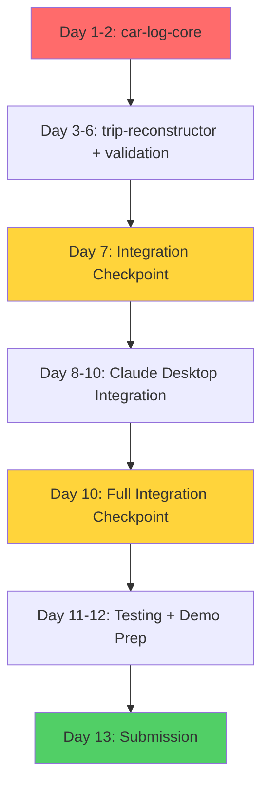

# Implementation Plan: Car Log - Parallel Development Strategy

**Version:** 1.0
**Date:** 2025-11-17
**Status:** Ready for Execution
**Target Deadline:** November 30, 2025 (13 days remaining)
**Project:** MCP 1st Birthday Hackathon Submission

---

## Executive Summary

### Timeline Overview

**Total Duration:** 13 days (November 17-30, 2025)
**Team Organization:** 3-4 parallel development tracks
**Target Scope:** P0 features only (Claude Desktop + 7 MCP servers)

### Critical Success Factors

1. **Parallel Development:** 4 independent tracks minimize critical path
2. **Clear Interfaces:** MCP tool signatures as contracts enable parallel work
3. **File-Based Storage:** No database setup reduces setup time
4. **Checkpoint-Based Plan:** Daily decision gates with scope flexibility
5. **P0 Focus:** Cut P1 features (Gradio UI, advanced OCR) if behind schedule

### Success Criteria

**Must-Have (P0) by Nov 30:**
- ✅ 7 MCP servers functional (car-log-core, trip-reconstructor, geo-routing, ekasa-api, dashboard-ocr, validation, report-generator)
- ✅ Claude Desktop integration complete
- ✅ End-to-end demo: Receipt → Checkpoint → Trip → Report
- ✅ Slovak tax compliance (VIN, driver name, trip timing fields)
- ✅ L/100km fuel efficiency format

**Nice-to-Have (P1) - Cut if needed:**
- ⏳ Gradio web UI
- ⏳ Advanced dashboard OCR (Claude Vision)
- ⏳ PDF report generation (CSV is enough)

---

## Part 1: Module Dependency Analysis

### Dependency Matrix

| MCP Server | Dependencies | Can Run Parallel With | Blocks |
|------------|--------------|----------------------|--------|
| **car-log-core** | None (foundational) | All others | trip-reconstructor, validation, report-generator |
| **ekasa-api** | None | car-log-core, geo-routing, dashboard-ocr | None |
| **geo-routing** | None (OpenStreetMap API) | car-log-core, ekasa-api, dashboard-ocr | None |
| **dashboard-ocr** | None (Claude Vision API) | car-log-core, ekasa-api, geo-routing | None |
| **trip-reconstructor** | car-log-core (data structures) | ekasa-api, geo-routing, dashboard-ocr | validation |
| **validation** | car-log-core, trip-reconstructor | ekasa-api, geo-routing, dashboard-ocr | report-generator |
| **report-generator** | car-log-core, validation | None (P1, can be last) | None |

### Module 1: car-log-core

**Priority:** P0 (CRITICAL - blocks 3 other servers)

**Dependencies:**
- None (foundational layer)

**Interface Contract:**
- **10 tools implemented:** `create_vehicle`, `get_vehicle`, `list_vehicles`, `update_vehicle`, `create_checkpoint`, `get_checkpoint`, `list_checkpoints`, `detect_gap`, `create_template`, `list_templates`
- **4-6 tools MISSING:** `create_trip`, `create_trips_batch`, `list_trips`, `get_trip` ❌ NOT IMPLEMENTED
- **Specification:** `07-mcp-api-specifications.md` lines 41-480
- **Storage:** JSON file-based in `~/Documents/MileageLog/data/`
- **Atomic Write Pattern:** Temp file + rename (04-data-model.md lines 829-856)

**⚠️ CRITICAL GAP:** Trip CRUD tools documented but not implemented. See TASKS.md section A6 for implementation tasks.

**Data Contracts:**
- **Reads/Writes:**
  - `data/vehicles/{id}.json`
  - `data/checkpoints/{YYYY-MM}/{id}.json`
  - `data/trips/{YYYY-MM}/{id}.json`
  - `data/typical-destinations.json`
- **Schemas:** `04-data-model.md` lines 53-740

**Parallel Development:**
- ✅ **Can develop in parallel with:** ekasa-api, geo-routing, dashboard-ocr (no dependencies)
- ❌ **Blocks:** trip-reconstructor (needs data structures), validation (needs trips), report-generator (needs validated trips)

**Integration Points:**
- **File System:** Atomic write pattern ensures crash safety
- **Claude Desktop:** MCP protocol for tool discovery
- **Validation:** Checkpoint/trip data flows to validation server

**Estimated Effort:** 16 hours
- Setup (file structure, UUID, datetime): 2 hours
- Vehicle CRUD (4 tools): 4 hours
- Checkpoint CRUD (3 tools): 4 hours
- Gap detection: 2 hours
- Template CRUD: 2 hours
- Testing + edge cases: 2 hours

---

### Module 2: trip-reconstructor

**Priority:** P0 (CRITICAL - core algorithm)

**Dependencies:**
- **car-log-core** (data structures for gap_data, templates)
- **WAIT FOR:** car-log-core data model finalized

**Interface Contract:**
- **2 tools:** `match_templates`, `calculate_template_completeness`
- **Specification:** `07-mcp-api-specifications.md` lines 450-720
- **Stateless:** All data passed as parameters (no database queries)

**Data Contracts:**
- **Input:** Gap data + templates (from car-log-core)
- **Output:** Matched templates with confidence scores
- **Algorithm:** Hybrid GPS (70%) + Address (30%) scoring

**Parallel Development:**
- ✅ **Can develop in parallel with:** ekasa-api, geo-routing, dashboard-ocr (no runtime dependencies)
- ❌ **Blocks:** validation (needs reconstruction results)
- ⚠️ **Requires:** car-log-core data structures defined (Day 2)

**Integration Points:**
- **car-log-core:** Receives gap data, templates
- **geo-routing:** Can use pre-calculated routes (optional)
- **Claude Desktop:** Orchestrates reconstruction workflow

**Estimated Effort:** 12 hours
- Haversine distance function: 1 hour
- GPS matching algorithm: 3 hours
- Address similarity (Levenshtein): 2 hours
- Hybrid scoring logic: 2 hours
- Proposal generation: 2 hours
- Testing with edge cases: 2 hours

---

### Module 3: geo-routing

**Priority:** P0 (CRITICAL - enables GPS-first architecture)

**Dependencies:**
- None (external API dependencies only)

**Interface Contract:**
- **3 tools:** `geocode_address`, `reverse_geocode`, `calculate_route`
- **Specification:** `07-mcp-api-specifications.md` lines 724-970
- **External APIs:** OSRM (routing), Nominatim (geocoding)

**Data Contracts:**
- **Input:** Addresses (string) or GPS coordinates
- **Output:** Geocoded coordinates, routes with distances
- **Ambiguity Handling:** Return alternatives if confidence < 0.7

**Parallel Development:**
- ✅ **Can develop in parallel with:** All other servers
- ❌ **Blocks:** None (optional dependency for others)

**Integration Points:**
- **car-log-core:** Provides GPS coordinates for checkpoints/templates
- **trip-reconstructor:** Pre-calculates routes for matching (optional)
- **Claude Desktop:** User-facing ambiguity resolution

**Estimated Effort:** 10 hours
- OSRM API integration: 3 hours
- Nominatim geocoding: 3 hours
- Ambiguity detection + ranking: 2 hours
- Caching layer (24hr TTL): 1 hour
- Testing with Slovak addresses: 1 hour

---

### Module 4: ekasa-api

**Priority:** P0 (CRITICAL - core value proposition)

**Dependencies:**
- None (external API dependencies only)

**Interface Contract:**
- **4 tools:** `scan_qr_code`, `fetch_receipt_data`, `queue_receipt`, `get_queue_status`
- **Specification:** `07-mcp-api-specifications.md` lines 973-1130
- **External API:** Slovak e-Kasa API

**Data Contracts:**
- **Input:** Receipt image path or receipt ID
- **Output:** Receipt data (vendor, fuel type, liters, cost, VAT)
- **Queue:** Background processing for slow API calls

**Parallel Development:**
- ✅ **Can develop in parallel with:** All other servers
- ❌ **Blocks:** None

**Integration Points:**
- **car-log-core:** Receipt data flows to checkpoint creation
- **Claude Desktop:** User pastes receipt photo

**Estimated Effort:** 12 hours
- QR code scanning (pyzbar): 2 hours
- e-Kasa API integration: 4 hours
- Fuel item detection (regex patterns): 2 hours
- Queue system (in-memory): 2 hours
- Error handling + retries: 2 hours

---

### Module 5: dashboard-ocr

**Priority:** P0 (photo handling) / P1 (OCR)

**Dependencies:**
- None (Claude Vision API)

**Interface Contract:**
- **3 tools:** `read_odometer`, `extract_metadata`, `check_photo_quality`
- **Specification:** `07-mcp-api-specifications.md` lines 1132-1248

**Data Contracts:**
- **Input:** Dashboard photo path
- **Output:** Odometer reading (integer), EXIF GPS/timestamp, quality assessment

**Parallel Development:**
- ✅ **Can develop in parallel with:** All other servers
- ❌ **Blocks:** None

**Integration Points:**
- **car-log-core:** Odometer readings + GPS coords flow to checkpoints
- **Claude Desktop:** User pastes dashboard photo

**Estimated Effort:** 8 hours
- EXIF extraction (Pillow): 2 hours
- Claude Vision integration: 3 hours
- Photo quality checks: 1 hour
- Fallback to manual entry: 1 hour
- Testing with real photos: 1 hour

**Scope Decision:**
- **P0:** EXIF extraction (GPS, timestamp)
- **P1:** OCR with Claude Vision (can fallback to manual entry)

---

### Module 6: validation

**Priority:** P0 (CRITICAL - credibility)

**Dependencies:**
- **car-log-core** (trip data)
- **trip-reconstructor** (reconstruction results)

**Interface Contract:**
- **4 tools:** `validate_checkpoint_pair`, `validate_trip`, `check_efficiency`, `check_deviation_from_average`
- **Specification:** `07-mcp-api-specifications.md` lines 1250-1390

**Data Contracts:**
- **Input:** Trip data, checkpoint pairs, fuel efficiency
- **Output:** Validation status (ok/warning/error), messages
- **Thresholds:** Distance ±10%, Consumption ±15%, Deviation 20%

**Parallel Development:**
- ❌ **Cannot start until:** car-log-core and trip-reconstructor have data structures
- ✅ **Can develop in parallel with:** ekasa-api, geo-routing, dashboard-ocr

**Integration Points:**
- **car-log-core:** Validates trips before saving
- **report-generator:** Only includes validated trips

**Estimated Effort:** 10 hours
- Distance sum validation: 2 hours
- Fuel consumption validation: 2 hours
- Efficiency reasonability (fuel-type ranges): 2 hours
- Deviation from average: 2 hours
- Validation config (JSON): 1 hour
- Testing with edge cases: 1 hour

---

### Module 7: report-generator

**Priority:** P1 (can use CSV fallback)

**Dependencies:**
- **car-log-core** (trip data)
- **validation** (only include validated trips)

**Interface Contract:**
- **2 tools:** `generate_pdf`, `generate_csv`
- **Specification:** `07-mcp-api-specifications.md` lines 1392-1477

**Data Contracts:**
- **Input:** Trip array, metadata (vehicle, period, company)
- **Output:** PDF/CSV file path, summary statistics

**Parallel Development:**
- ❌ **Cannot start until:** car-log-core has trip data
- ✅ **Can develop in parallel with:** All others (no runtime dependencies)

**Integration Points:**
- **car-log-core:** Fetches trips for period
- **validation:** Filters for validated trips only

**Estimated Effort:** 8 hours (P1)
- CSV generation: 2 hours
- PDF template (ReportLab): 4 hours
- Slovak compliance fields: 1 hour
- Testing with real data: 1 hour

**Scope Decision:**
- **P0:** CSV generation (accounting software compatible)
- **P1:** PDF generation (nice-to-have)

---

## Part 2: Parallel Development Tracks

### Track A: Data Foundation (CRITICAL PATH)

**Priority:** P0 (everything depends on this)
**Developer Allocation:** 2 developers
**Duration:** Days 1-3

**Components:**
- **car-log-core** (16 hours)
  - Developer 1: Vehicle + Checkpoint CRUD (10 hours)
  - Developer 2: Gap detection + Template CRUD (6 hours)

**Deliverables by Day 3:**
- ✅ All 8 tools functional
- ✅ Atomic write pattern working
- ✅ Example JSON files created
- ✅ MCP tool discovery working in Claude Desktop

**Risk Mitigation:**
- **Day 2 Checkpoint:** Vehicle + Checkpoint CRUD done
- **Red Flag:** File corruption on crash → Fix atomic write immediately

---

### Track B: External Integrations (PARALLEL)

**Priority:** P0
**Developer Allocation:** 2 developers
**Duration:** Days 1-4

**Components:**
- **Developer 1: ekasa-api** (12 hours)
  - QR scanning + API integration
  - Fuel item detection
  - Queue system
- **Developer 2: geo-routing** (10 hours)
  - Geocoding with ambiguity handling
  - Route calculation (OSRM)
  - Caching layer

**Deliverables by Day 4:**
- ✅ ekasa-api: Can scan receipt and fetch data
- ✅ geo-routing: Can geocode addresses and calculate routes
- ✅ Both servers discoverable in Claude Desktop

**Risk Mitigation:**
- **Day 2 Checkpoint:** QR scanning working
- **Red Flag:** e-Kasa API unavailable → Use mock API for demo

---

### Track C: Intelligence & Validation (DEPENDS ON TRACK A)

**Priority:** P0
**Developer Allocation:** 2 developers
**Duration:** Days 3-6 (starts after car-log-core Day 2 checkpoint)

**Components:**
- **Developer 1: trip-reconstructor** (12 hours)
  - Hybrid GPS + address matching
  - Proposal generation
- **Developer 2: validation** (10 hours)
  - 4 validation algorithms
  - Threshold configuration

**Deliverables by Day 6:**
- ✅ trip-reconstructor: Can match templates with confidence scores
- ✅ validation: Can validate trips with warnings/errors
- ✅ End-to-end reconstruction workflow working

**Risk Mitigation:**
- **Day 4 Checkpoint:** GPS matching algorithm working
- **Red Flag:** Address matching too slow → Reduce string similarity complexity

---

### Track D: User Experience (DEPENDS ON ALL TRACKS)

**Priority:** P0 (Claude Desktop) / P1 (Gradio)
**Developer Allocation:** 1 developer
**Duration:** Days 7-11

**Components:**
- **Claude Desktop Integration** (16 hours)
  - MCP server orchestration
  - Error handling + user feedback
  - End-to-end workflows
  - Demo preparation

**Deliverables by Day 11:**
- ✅ Complete demo workflow functional
- ✅ Receipt → Checkpoint → Trip → Report
- ✅ All 7 MCP servers integrated
- ✅ User-friendly error messages

**Risk Mitigation:**
- **Day 9 Checkpoint:** Basic workflow working
- **Red Flag:** Integration issues → Focus on core workflow only

---

## Part 3: Feature Breakdown with User Stories

### F1: Vehicle Management

**User Story:**
As a business owner, I want to register my company vehicle with VIN and license plate, so that I can start tracking mileage for tax purposes.

**Acceptance Criteria:**
- AC1: I can create a vehicle with name, license plate (BA-456CD format), VIN (17 chars), fuel type
- AC2: VIN is validated (no I/O/Q characters)
- AC3: Vehicle is saved to `data/vehicles/{id}.json`
- AC4: I can list all vehicles
- AC5: I can update vehicle details (name, efficiency)

**Technical Components:**
- **MCP Server:** car-log-core
- **Tools:** `create_vehicle`, `get_vehicle`, `list_vehicles`, `update_vehicle`
- **Data Model:** `04-data-model.md` lines 53-170
- **API Spec:** `07-mcp-api-specifications.md` lines 41-270

**Dependencies:**
- File system access (atomic write pattern)
- UUID generation
- ISO 8601 datetime

**Parallel Work:**
- ✅ Can develop while others work on ekasa-api, geo-routing

**Estimated Effort:** 4 hours
- Setup (file structure, UUID): 1 hour
- CRUD operations (4 tools): 2 hours
- Validation (VIN, license plate regex): 1 hour

**Developer Assignment:** Track A, Developer 1, Days 1-2

---

### F2: Checkpoint Creation (Refuel)

**User Story:**
As a driver, I want to create a refuel checkpoint by pasting my receipt photo and dashboard photo, so that the system automatically captures odometer, GPS, fuel data.

**Acceptance Criteria:**
- AC1: I can paste a receipt photo and system scans QR code
- AC2: System fetches receipt data from e-Kasa API (fuel type, liters, cost, VAT)
- AC3: I can paste a dashboard photo and system reads odometer (with fallback to manual)
- AC4: System extracts GPS coordinates from EXIF metadata
- AC5: Checkpoint is saved with all data

**Technical Components:**
- **MCP Servers:** car-log-core, ekasa-api, dashboard-ocr
- **Tools:** `create_checkpoint`, `scan_qr_code`, `fetch_receipt_data`, `extract_metadata`
- **Data Model:** `04-data-model.md` lines 173-352
- **API Spec:** `07-mcp-api-specifications.md` lines 273-353, 973-1130, 1132-1212

**Dependencies:**
- car-log-core (checkpoint storage)
- ekasa-api (receipt processing)
- dashboard-ocr (EXIF extraction)

**Parallel Work:**
- ⚠️ car-log-core must finish first (Day 2)
- ✅ ekasa-api and dashboard-ocr can develop in parallel

**Estimated Effort:** 10 hours
- Checkpoint creation flow: 2 hours
- Receipt integration: 3 hours
- EXIF extraction: 2 hours
- Gap detection trigger: 1 hour
- Testing with real photos: 2 hours

**Developer Assignment:**
- Track A (checkpoint storage): Days 2-3
- Track B (integrations): Days 2-4

---

### F3: Receipt Processing (e-Kasa)

**User Story:**
As a driver, I want to scan my fuel receipt QR code, so that I don't have to manually enter fuel quantity, price, and VAT.

**Acceptance Criteria:**
- AC1: System scans QR code from receipt photo
- AC2: System fetches full receipt data from Slovak e-Kasa API
- AC3: System detects fuel items (Diesel, Gasoline, etc.)
- AC4: System extracts fuel quantity (liters), price per liter, total cost, VAT amount
- AC5: System handles non-fuel items (coffee, car wash) separately

**Technical Components:**
- **MCP Server:** ekasa-api
- **Tools:** `scan_qr_code`, `fetch_receipt_data`
- **Data Model:** Receipt embedded in checkpoint (04-data-model.md lines 247-295)
- **API Spec:** `07-mcp-api-specifications.md` lines 980-1069

**Dependencies:**
- QR code scanning library (pyzbar)
- Slovak e-Kasa API access
- Fuel type detection patterns

**Parallel Work:**
- ✅ Can develop completely independently
- ✅ No blocking dependencies

**Estimated Effort:** 8 hours
- QR code scanning: 2 hours
- e-Kasa API integration: 4 hours
- Fuel item detection: 2 hours

**Developer Assignment:** Track B, Developer 1, Days 1-3

---

### F4: Dashboard Photo OCR

**User Story:**
As a driver, I want to take a photo of my dashboard, so that the system automatically reads my odometer instead of me typing it.

**Acceptance Criteria:**
- AC1: System extracts GPS coordinates from photo EXIF (if available)
- AC2: System extracts timestamp from photo EXIF
- AC3: (P1) System reads odometer using Claude Vision OCR with 90%+ accuracy
- AC4: (P1) If OCR confidence < 0.7, system prompts for manual entry
- AC5: (P1) System validates photo quality (brightness, blur, resolution)

**Technical Components:**
- **MCP Server:** dashboard-ocr
- **Tools:** `extract_metadata` (P0), `read_odometer` (P1), `check_photo_quality` (P1)
- **API Spec:** `07-mcp-api-specifications.md` lines 1140-1247

**Dependencies:**
- EXIF extraction (Pillow library) - P0
- Claude Vision API - P1

**Parallel Work:**
- ✅ Can develop completely independently
- ✅ P0 (EXIF only) has no API dependencies

**Estimated Effort:**
- **P0 (EXIF only):** 2 hours
- **P1 (full OCR):** 8 hours total

**Developer Assignment:** Track B, Developer 2, Days 3-4 (P0), Days 8-9 (P1 if time allows)

**Scope Decision:**
- **Day 7 Checkpoint:** If behind schedule, cut P1 OCR → Manual odometer entry only

---

### F5: Trip Reconstruction (Template-Based)

**User Story:**
As a business owner, I want the system to suggest trips based on my saved templates, so that I can reconstruct a week of driving with 3 clicks instead of 30 minutes of manual entry.

**Acceptance Criteria:**
- AC1: System detects gap between checkpoints (distance > 50km or time > 2 days)
- AC2: System matches my templates using hybrid GPS (70%) + address (30%) scoring
- AC3: System shows confidence scores for each template match
- AC4: System proposes trip combination to cover gap distance
- AC5: I can approve/edit/reject proposal

**Technical Components:**
- **MCP Servers:** car-log-core, trip-reconstructor, geo-routing (optional)
- **Tools:** `detect_gap`, `match_templates`, `calculate_route` (optional)
- **Algorithm:** `06-mcp-architecture-v2.md` lines 626-844 (pseudocode)
- **API Spec:** `07-mcp-api-specifications.md` lines 457-656

**Dependencies:**
- car-log-core (gap detection, templates)
- trip-reconstructor (matching algorithm)
- geo-routing (optional pre-calculated routes)

**Parallel Work:**
- ❌ Requires car-log-core data structures (Day 2)
- ✅ Can develop algorithm logic independently with mock data

**Estimated Effort:** 12 hours
- Haversine GPS matching: 3 hours
- Address similarity: 2 hours
- Hybrid scoring: 2 hours
- Proposal generation: 2 hours
- Integration with car-log-core: 2 hours
- Testing: 1 hour

**Developer Assignment:** Track C, Developer 1, Days 3-6

---

### F6: Geo-Routing (Address → Coordinates)

**User Story:**
As a user creating a template, I want to type "Bratislava" and see multiple options if ambiguous, so that I can pick the exact location without knowing GPS coordinates.

**Acceptance Criteria:**
- AC1: I can enter an address (e.g., "Hlavná 45, Bratislava")
- AC2: System geocodes to GPS coordinates with confidence score
- AC3: If confidence < 0.7, system shows 3-5 alternatives
- AC4: I can select the correct location from alternatives
- AC5: System saves both GPS (source of truth) and address (label)

**Technical Components:**
- **MCP Server:** geo-routing
- **Tools:** `geocode_address`, `reverse_geocode`, `calculate_route`
- **API Spec:** `07-mcp-api-specifications.md` lines 732-970
- **External API:** Nominatim (OpenStreetMap)

**Dependencies:**
- Nominatim geocoding API
- Address normalization logic
- Confidence scoring

**Parallel Work:**
- ✅ Can develop completely independently
- ✅ No blocking dependencies

**Estimated Effort:** 10 hours
- Nominatim API integration: 3 hours
- Ambiguity detection + ranking: 3 hours
- OSRM route calculation: 3 hours
- Caching (24hr TTL): 1 hour

**Developer Assignment:** Track B, Developer 2, Days 1-4

---

### F7: Validation (4 Algorithms)

**User Story:**
As a business owner, I want the system to warn me if a trip looks suspicious (e.g., 2 L/100km efficiency or 1000 km in 1 day), so that I catch data entry errors before the tax inspector does.

**Acceptance Criteria:**
- AC1: System validates distance sum (total trip distances ≈ odometer delta ±10%)
- AC2: System validates fuel consumption (expected fuel ≈ actual fuel ±15%)
- AC3: System validates efficiency reasonability (Diesel: 5-15 L/100km, Gasoline: 6-20 L/100km)
- AC4: System validates deviation from vehicle average (warn if >20% deviation)
- AC5: System provides actionable suggestions for warnings

**Technical Components:**
- **MCP Server:** validation
- **Tools:** `validate_checkpoint_pair`, `validate_trip`, `check_efficiency`, `check_deviation_from_average`
- **Algorithms:** `00-ENHANCEMENTS-FROM-MILESTONE-SPEC.md` lines 160-299
- **API Spec:** `07-mcp-api-specifications.md` lines 1259-1390

**Dependencies:**
- car-log-core (trip data)
- Validation thresholds config

**Parallel Work:**
- ❌ Requires car-log-core trip structure (Day 3)
- ✅ Can develop algorithm logic independently

**Estimated Effort:** 10 hours
- 4 validation algorithms: 8 hours
- Config + thresholds: 1 hour
- Testing with edge cases: 1 hour

**Developer Assignment:** Track C, Developer 2, Days 4-6

---

### F8: Report Generation (PDF/CSV)

**User Story:**
As a business owner, I want to generate a monthly PDF report with all my business trips, so that I can submit it to my accountant for tax deduction.

**Acceptance Criteria:**
- AC1: (P0) System generates CSV file with all trips for a period
- AC2: (P1) System generates PDF with Slovak VAT compliance fields (VIN, driver name, trip times/locations)
- AC3: Report includes summary: total trips, distance, fuel, cost, VAT deductible
- AC4: Report filters for Business trips only (excludes Personal)
- AC5: Report is saved to `reports/{YYYY-MM}/` folder

**Technical Components:**
- **MCP Server:** report-generator
- **Tools:** `generate_csv` (P0), `generate_pdf` (P1)
- **API Spec:** `07-mcp-api-specifications.md` lines 1401-1477

**Dependencies:**
- car-log-core (trip data)
- validation (only include validated trips)

**Parallel Work:**
- ❌ Requires car-log-core trip data (Day 3)
- ✅ Can develop template independently

**Estimated Effort:**
- **P0 (CSV only):** 2 hours
- **P1 (PDF):** 8 hours total

**Developer Assignment:** Track D, Days 10-11 (P0 required, P1 if time allows)

**Scope Decision:**
- **Day 9 Checkpoint:** If behind schedule, CSV only (no PDF)

---

### F9: Claude Desktop Integration

**User Story:**
As a user, I want to interact with Car Log through natural conversation in Claude Desktop, so that I don't have to learn a complex UI or fill out forms.

**Acceptance Criteria:**
- AC1: I can create a vehicle by chatting "Add Ford Transit, BA-456CD, VIN WBAXX..."
- AC2: I can paste receipt photo and dashboard photo in conversation
- AC3: Claude guides me through checkpoint creation conversationally
- AC4: Claude detects gaps and suggests reconstruction
- AC5: I can approve trips with "yes" instead of clicking buttons

**Technical Components:**
- **All MCP Servers:** Orchestrated by Claude Skills
- **Dual Interface:** Claude Desktop (P0), Gradio (P1)
- **Architecture:** `05-claude-skills-dspy.md`

**Dependencies:**
- All 7 MCP servers functional
- MCP protocol configuration

**Parallel Work:**
- ❌ Cannot start until Day 7 (all servers ready)

**Estimated Effort:** 16 hours
- MCP server configuration: 2 hours
- Workflow orchestration: 6 hours
- Error handling + user feedback: 4 hours
- Demo preparation: 4 hours

**Developer Assignment:** Track D, Developer 1, Days 7-11

---

## Part 4: Development Timeline (13 Days)

### Week 1: Foundation (Days 1-7)

```
Day 1: Project Setup + Parallel Kickoff
├─ Track A: car-log-core setup (file structure, atomic write pattern)
├─ Track B: ekasa-api QR scanning + geo-routing geocoding
└─ Track C: (waiting for car-log-core Day 2)

Day 2: CHECKPOINT - Vehicle + Checkpoint CRUD
├─ Track A: ✅ Vehicle CRUD + Checkpoint CRUD functional
├─ Track B: ekasa-api (e-Kasa API integration) + geo-routing (route calculation)
└─ Track C: trip-reconstructor starts (data structures available)

Day 3: Gap Detection + Trip Structure
├─ Track A: ✅ Gap detection + Template CRUD complete
├─ Track B: ✅ ekasa-api complete, ✅ geo-routing complete
└─ Track C: trip-reconstructor (GPS matching), validation starts

Day 4: CHECKPOINT - All External APIs Working
├─ Track A: car-log-core testing + bug fixes
├─ Track B: ✅ All external integrations complete
└─ Track C: trip-reconstructor (address matching + hybrid scoring)

Day 5: Algorithm Development
├─ Track A: car-log-core complete
├─ Track B: Integration testing
└─ Track C: trip-reconstructor (proposal generation), validation (algorithms 1-2)

Day 6: CHECKPOINT - Intelligence Complete
├─ Track A: car-log-core documentation
├─ Track B: Bug fixes
└─ Track C: ✅ trip-reconstructor complete, ✅ validation complete

Day 7: INTEGRATION CHECKPOINT (CRITICAL)
├─ All P0 MCP servers functional individually
├─ All servers discoverable in Claude Desktop
├─ Integration smoke test (can call each tool)
└─ DECISION GATE: Pass → Continue | Fail → Cut P1 features
```

### Week 2: Integration + Testing (Days 8-13)

```
Day 8: Claude Desktop Integration Begins
├─ Track D: MCP server orchestration + basic workflow
├─ All Tracks: Bug fixes from integration testing
└─ P1 Decision: Start dashboard-ocr OCR if ahead of schedule

Day 9: End-to-End Workflow
├─ Track D: Receipt → Checkpoint workflow
├─ Track D: Checkpoint → Trip reconstruction workflow
└─ CHECKPOINT: Basic workflow functional

Day 10: CHECKPOINT - Full Integration Complete
├─ Track D: ✅ Complete demo workflow functional
├─ Track D: Error handling + user feedback
└─ DECISION GATE: Pass → Continue | Fail → Cut ALL P1

Day 11: Testing + Polish
├─ Track D: End-to-end testing with real data
├─ Track D: Report generation (CSV P0, PDF P1)
└─ Bug fixes + edge cases

Day 12: Demo Preparation
├─ Create demo dataset (vehicles, checkpoints, trips)
├─ Record demo video (5 minutes max)
├─ Prepare presentation slides
└─ Practice demo (Receipt → Checkpoint → Trip → Report)

Day 13: Hackathon Submission (Nov 30)
├─ Final testing
├─ Documentation review
├─ Submit to MCP 1st Birthday Hackathon
└─ 🎉 Deploy demo instance
```

### Critical Path



**Critical Path Duration:** 13 days (no slack)

**Parallel Tracks:**
- Track B (ekasa-api + geo-routing) runs Days 1-4 (no impact on critical path)
- Track C (trip-reconstructor + validation) runs Days 3-6 (on critical path)
- Track D (Claude Desktop) runs Days 7-11 (on critical path)

---

## Part 5: Integration Strategy

### Integration Point 1: File System Integration

**Contract:** All servers → JSON files (atomic write pattern)

**Test Plan:**
```
Day 3:
- ✅ Create vehicle → Verify data/vehicles/{id}.json exists
- ✅ Create checkpoint → Verify data/checkpoints/2025-11/{id}.json exists
- ✅ Crash during write → Verify no corrupted files (atomic write)

Day 6:
- ✅ Concurrent writes → Verify no data loss
- ✅ Read after write → Verify data consistency
```

**Risk:** File corruption on crash
**Mitigation:** Atomic write pattern (temp file + rename)

---

### Integration Point 2: MCP Protocol Integration

**Contract:** All servers → Claude Desktop (tool discovery + request/response)

**Test Plan:**
```
Day 7 (Integration Checkpoint):
- ✅ Start all 7 MCP servers → Verify Claude Desktop discovers all tools
- ✅ Call create_vehicle → Verify request/response format
- ✅ Error handling → Verify error response format
- ✅ Timeout handling → Verify graceful degradation
```

**Risk:** Tool discovery failure
**Mitigation:** MCP configuration validation script

---

### Integration Point 3: Data Flow Integration (Cross-Server)

**Contract:** ekasa-api → car-log-core (receipt data flows to checkpoint)

**Test Plan:**
```
Day 8:
- ✅ User pastes receipt photo
- ✅ ekasa-api scans QR + fetches data
- ✅ car-log-core creates checkpoint with receipt data
- ✅ Verify receipt embedded in checkpoint JSON

Workflow: scan_qr_code → fetch_receipt_data → create_checkpoint
```

**Risk:** Data mapping errors (flat API → nested JSON)
**Mitigation:** Integration tests with real receipt data

---

**Contract:** dashboard-ocr → car-log-core (odometer + GPS flows to checkpoint)

**Test Plan:**
```
Day 8:
- ✅ User pastes dashboard photo
- ✅ dashboard-ocr extracts EXIF (GPS, timestamp)
- ✅ (P1) dashboard-ocr reads odometer via OCR
- ✅ car-log-core creates checkpoint with extracted data

Workflow: extract_metadata → read_odometer → create_checkpoint
```

**Risk:** Missing EXIF data (photo taken with GPS disabled)
**Mitigation:** Fallback to manual entry

---

**Contract:** car-log-core → validation (trip data flows to validation)

**Test Plan:**
```
Day 9:
- ✅ Create trip with unrealistic efficiency (2 L/100km)
- ✅ validation.validate_trip returns error
- ✅ User sees actionable error message
- ✅ User corrects trip, validation passes

Workflow: create_trip → validate_trip → save if validated
```

**Risk:** Validation too strict (rejects valid trips)
**Mitigation:** Configurable thresholds, warning vs. error levels

---

**Contract:** car-log-core → trip-reconstructor (gap data + templates flow to matching)

**Test Plan:**
```
Day 9:
- ✅ Create two checkpoints 530 km apart
- ✅ car-log-core detects gap
- ✅ car-log-core fetches user templates
- ✅ trip-reconstructor matches templates with confidence scores
- ✅ User approves proposal
- ✅ car-log-core creates trips from proposal

Workflow: detect_gap → list_templates → match_templates → create_trips_batch
```

**Risk:** Matching algorithm produces low confidence scores
**Mitigation:** Test with real-world template data, adjust weights

---

### Integration Testing Schedule

| Day | Test Type | Focus |
|-----|-----------|-------|
| **Day 7** | Smoke Test | All servers start, tools discoverable |
| **Day 8** | Data Flow Test | Create checkpoint with receipt + dashboard photo |
| **Day 9** | End-to-End Test | Full workflow: Receipt → Checkpoint → Trip → Report |
| **Day 10** | Edge Case Test | Invalid data, missing data, network errors |
| **Day 11** | Performance Test | 100+ trips, large gap reconstruction |

---

## Part 6: Risk Mitigation & Scope Decisions

### Decision Gates

#### Day 7 Checkpoint: P0 MCP Servers Functional

**Criteria:**
- ✅ All 7 servers start without errors
- ✅ Claude Desktop discovers all 24 tools (21 P0, 3 P1)
- ✅ Basic CRUD operations work (create vehicle, create checkpoint)
- ✅ Atomic write pattern prevents file corruption

**Decision:**
- **PASS:** Continue to Claude Desktop integration
- **FAIL:**
  - Cut P1 features: Gradio UI, dashboard OCR, PDF reports
  - Focus: Fix core CRUD + integration issues
  - Deadline: Fix by end of Day 8 or abort

---

#### Day 10 Checkpoint: Claude Desktop Integration Complete

**Criteria:**
- ✅ End-to-end demo working: Receipt → Checkpoint → Trip → Report
- ✅ Error handling graceful (no crashes)
- ✅ User can complete workflow in <5 minutes
- ✅ All P0 features functional

**Decision:**
- **PASS:** Continue to P1 features (if time allows) + demo prep
- **FAIL:**
  - Cut ALL P1 features
  - Focus: Core demo stability only
  - Deadline: Demo must work by Day 12

---

### Scope Cut Priority (If Behind Schedule)

**Never Cut (Sacred P0):**
1. ✅ Receipt processor (ekasa-api) - core value prop
2. ✅ Trip manager (car-log-core) - foundational
3. ✅ Template matching (trip-reconstructor) - innovation
4. ✅ Validation (validation) - credibility
5. ✅ CSV report generation - deliverable
6. ✅ Claude Desktop integration - MCP showcase
7. ✅ Slovak compliance fields (VIN, driver, trip timing)

**Cut in This Order (P1):**
1. **First:** Gradio UI - Claude Desktop is enough
2. **Second:** Dashboard OCR (Claude Vision) - Manual odometer entry acceptable
3. **Third:** PDF report generation - CSV is enough for accountants
4. **Fourth:** Route intelligence (geo-routing calculate_route) - Manual distance entry acceptable

---

### Daily Red Flags

**Day 2:**
- 🚩 Atomic write pattern not working → File corruption risk
- 🚩 VIN validation failing → Slovak compliance broken
- **Action:** Stop all other work, fix atomic write + validation

**Day 4:**
- 🚩 e-Kasa API unavailable → Cannot demo receipt processing
- **Action:** Create mock e-Kasa API for demo

**Day 6:**
- 🚩 Template matching confidence scores all <50% → Algorithm broken
- **Action:** Review GPS matching logic, test with real coordinates

**Day 9:**
- 🚩 Claude Desktop orchestration not working → Cannot complete demo
- **Action:** Simplify workflows, remove optional features

**Day 11:**
- 🚩 End-to-end demo crashes → Demo day failure imminent
- **Action:** Create fallback demo script with manual steps

---

## Part 7: Testing Strategy

### Unit Testing

**car-log-core:**
```python
def test_create_vehicle_valid():
    result = create_vehicle({
        "name": "Ford Transit",
        "license_plate": "BA-456CD",
        "vin": "WBAXX01234ABC5678",
        "fuel_type": "Diesel",
        "initial_odometer_km": 15000
    })
    assert result["success"] == True
    assert result["vehicle_id"] is not None
    # Verify file exists
    assert Path(f"data/vehicles/{result['vehicle_id']}.json").exists()

def test_create_vehicle_invalid_vin():
    result = create_vehicle({"vin": "INVALID123"})  # Too short
    assert result["success"] == False
    assert result["error"]["code"] == "VALIDATION_ERROR"

def test_atomic_write_crash_safety():
    # Simulate crash during write
    with pytest.raises(SimulatedCrash):
        create_checkpoint_with_crash()
    # Verify no corrupted files
    assert not Path("data/checkpoints/2025-11/*.tmp").exists()
```

**trip-reconstructor:**
```python
def test_gps_matching_exact():
    template = {"from_coords": {"lat": 48.1486, "lng": 17.1077}}
    gap_start = {"coords": {"lat": 48.1486, "lng": 17.1077}}
    score = score_gps_match(template, gap_start)
    assert score["start_score"] == 100  # Exact match

def test_gps_matching_100m_away():
    template = {"from_coords": {"lat": 48.1486, "lng": 17.1077}}
    gap_start = {"coords": {"lat": 48.1495, "lng": 17.1077}}  # ~100m north
    score = score_gps_match(template, gap_start)
    assert 90 <= score["start_score"] <= 100

def test_address_similarity():
    template_addr = "Hlavná 12, Bratislava"
    gap_addr = "Hlavna 12, Bratislava"  # Missing accent
    similarity = calculate_address_similarity(template_addr, gap_addr)
    assert similarity > 0.9
```

**geo-routing:**
```python
def test_geocode_clear_address():
    result = geocode_address("Hlavná 45, Bratislava", country_hint="SK")
    assert result["success"] == True
    assert result["confidence"] > 0.9
    assert len(result["alternatives"]) == 0

def test_geocode_ambiguous_address():
    result = geocode_address("Košice")
    assert result["success"] == True
    assert result["confidence"] < 0.7
    assert len(result["alternatives"]) >= 2
```

**validation:**
```python
def test_efficiency_check_diesel_reasonable():
    result = check_efficiency(8.5, "Diesel")  # Typical van efficiency
    assert result["status"] == "ok"

def test_efficiency_check_diesel_unrealistic():
    result = check_efficiency(2.0, "Diesel")  # Too low
    assert result["status"] == "error"
    assert "unrealistically LOW" in result["message"]
```

---

### Integration Testing

**Scenario 1: Create Checkpoint from Receipt + Dashboard Photo**
```python
def test_checkpoint_creation_with_photos():
    # Step 1: Scan receipt QR
    qr_result = ekasa_api.scan_qr_code("receipt_photo.jpg")
    assert qr_result["success"] == True

    # Step 2: Fetch receipt data
    receipt_result = ekasa_api.fetch_receipt_data(qr_result["receipt_id"])
    assert len(receipt_result["fuel_items"]) > 0

    # Step 3: Extract EXIF from dashboard photo
    exif_result = dashboard_ocr.extract_metadata("dashboard_photo.jpg")
    assert exif_result["gps_coords"] is not None

    # Step 4: Create checkpoint
    checkpoint_result = car_log_core.create_checkpoint({
        "vehicle_id": "vehicle-123",
        "checkpoint_type": "refuel",
        "datetime": exif_result["timestamp"],
        "odometer_km": 45550,  # From OCR or manual
        "location_coords": exif_result["gps_coords"],
        "receipt_id": qr_result["receipt_id"],
        "fuel_liters": receipt_result["fuel_items"][0]["quantity"]
    })
    assert checkpoint_result["success"] == True
    assert checkpoint_result["gap_detected"] == True
```

**Scenario 2: Trip Reconstruction from Templates**
```python
def test_trip_reconstruction_workflow():
    # Step 1: Detect gap
    gap_result = car_log_core.detect_gap("checkpoint-1", "checkpoint-2")
    assert gap_result["distance_km"] == 530

    # Step 2: Fetch templates
    templates_result = car_log_core.list_templates("user-123")
    assert len(templates_result["templates"]) >= 2

    # Step 3: Match templates
    match_result = trip_reconstructor.match_templates({
        "gap_data": gap_result,
        "templates": templates_result["templates"]
    })
    assert len(match_result["matched_templates"]) > 0
    assert match_result["matched_templates"][0]["confidence_score"] >= 70

    # Step 4: Create trips from proposal
    proposal = match_result["reconstruction_proposal"]["proposed_trips"]
    trips_result = car_log_core.create_trips_batch({
        "trips": [convert_proposal_to_trip(p) for p in proposal]
    })
    assert trips_result["success"] == True
    assert trips_result["created_trip_ids"] == len(proposal)
```

---

### Performance Testing

**Test 1: Template Matching with 100+ Templates**
```python
def test_matching_performance_100_templates():
    templates = generate_mock_templates(count=100)
    gap_data = generate_mock_gap(distance_km=530)

    start_time = time.time()
    result = trip_reconstructor.match_templates({
        "gap_data": gap_data,
        "templates": templates
    })
    duration = time.time() - start_time

    assert duration < 2.0  # Must complete in <2 seconds
    assert len(result["matched_templates"]) == 100
```

**Test 2: File-Based Storage with 1000+ Trips**
```python
def test_file_storage_performance():
    # Create 1000 trips across 12 months
    for month in range(1, 13):
        for trip_num in range(1, 84):  # ~83 trips/month
            create_trip(month=f"2025-{month:02d}")

    # Test read performance
    start_time = time.time()
    trips = car_log_core.list_trips(
        vehicle_id="vehicle-123",
        start_date="2025-01-01",
        end_date="2025-12-31"
    )
    duration = time.time() - start_time

    assert len(trips["trips"]) == 1000
    assert duration < 5.0  # Must complete in <5 seconds with index files
```

---

## Part 8: Configuration & Setup

### MCP Server Configuration

**File:** `~/Library/Application Support/Claude/claude_desktop_config.json` (macOS)

```json
{
  "mcpServers": {
    "car-log-core": {
      "command": "python",
      "args": ["-m", "mcp_servers.car_log_core"],
      "env": {
        "DATA_PATH": "~/Documents/MileageLog/data",
        "USE_ATOMIC_WRITES": "true",
        "GENERATE_MONTHLY_INDEX": "true"
      }
    },
    "trip-reconstructor": {
      "command": "python",
      "args": ["-m", "mcp_servers.trip_reconstructor"],
      "env": {
        "GPS_WEIGHT": "0.7",
        "ADDRESS_WEIGHT": "0.3",
        "CONFIDENCE_THRESHOLD": "70"
      }
    },
    "geo-routing": {
      "command": "node",
      "args": ["./mcp-servers/geo-routing/index.js"],
      "env": {
        "OSRM_BASE_URL": "https://router.project-osrm.org",
        "NOMINATIM_BASE_URL": "https://nominatim.openstreetmap.org",
        "CACHE_TTL_HOURS": "24"
      }
    },
    "ekasa-api": {
      "command": "python",
      "args": ["-m", "mcp_servers.ekasa_api"],
      "env": {
        "EKASA_API_KEY": "${EKASA_API_KEY}",
        "QUEUE_MAX_SIZE": "100"
      }
    },
    "dashboard-ocr": {
      "command": "python",
      "args": ["-m", "mcp_servers.dashboard_ocr"],
      "env": {
        "ANTHROPIC_API_KEY": "${ANTHROPIC_API_KEY}",
        "OCR_CONFIDENCE_THRESHOLD": "0.7"
      }
    },
    "validation": {
      "command": "python",
      "args": ["-m", "mcp_servers.validation"],
      "env": {
        "DISTANCE_VARIANCE_PERCENT": "10",
        "CONSUMPTION_VARIANCE_PERCENT": "15",
        "DEVIATION_THRESHOLD_PERCENT": "20"
      }
    },
    "report-generator": {
      "command": "python",
      "args": ["-m", "mcp_servers.report_generator"],
      "env": {
        "REPORTS_PATH": "~/Documents/MileageLog/reports"
      }
    }
  }
}
```

---

### Environment Variables

**Required:**
- `ANTHROPIC_API_KEY` - For dashboard OCR (Claude Vision)
- `EKASA_API_KEY` - For Slovak e-Kasa receipt API

**Optional:**
- `DATA_PATH` - Override default data location
- `REPORTS_PATH` - Override default reports location

---

### Development Setup Script

```bash
#!/bin/bash
# setup-dev-environment.sh

# Create directory structure
mkdir -p ~/Documents/MileageLog/data/{vehicles,checkpoints,trips,receipts,dashboard-photos,reports}

# Create Python virtual environment
python -m venv venv
source venv/bin/activate

# Install Python dependencies
pip install -r requirements.txt

# Install Node.js dependencies (for geo-routing)
cd mcp-servers/geo-routing && npm install && cd ../..

# Copy example config
cp claude_desktop_config.example.json ~/Library/Application\ Support/Claude/claude_desktop_config.json

# Generate test data
python scripts/generate_test_data.py

echo "✅ Development environment ready!"
echo "⚠️  Remember to set ANTHROPIC_API_KEY and EKASA_API_KEY"
```

---

## Part 9: Demo Preparation

### Demo Dataset

**Create realistic test data for demo (Day 12):**

```python
# scripts/generate_demo_data.py

def create_demo_dataset():
    # 1. Create vehicle
    vehicle_id = create_vehicle({
        "name": "Ford Transit Delivery Van",
        "license_plate": "BA-456CD",
        "vin": "WBAXX01234ABC5678",
        "fuel_type": "Diesel",
        "initial_odometer_km": 45000
    })["vehicle_id"]

    # 2. Create templates
    warehouse_template = create_template({
        "name": "Warehouse Run to Košice",
        "from_coords": {"lat": 48.1486, "lng": 17.1077},  # Bratislava
        "from_address": "Bratislava Office, Hlavná 12",
        "to_coords": {"lat": 48.7164, "lng": 21.2611},    # Košice
        "to_address": "Warehouse, Mlynská 45, Košice",
        "distance_km": 410,
        "is_round_trip": True,
        "typical_days": ["Monday", "Thursday"],
        "purpose": "business",
        "business_description": "Warehouse pickup"
    })

    # 3. Create checkpoints with gaps
    checkpoint1 = create_checkpoint({
        "vehicle_id": vehicle_id,
        "checkpoint_type": "refuel",
        "datetime": "2025-11-01T08:00:00Z",
        "odometer_km": 45000,
        "fuel_liters": 60.0,
        "fuel_cost_eur": 84.00
    })

    checkpoint2 = create_checkpoint({
        "vehicle_id": vehicle_id,
        "checkpoint_type": "refuel",
        "datetime": "2025-11-08T17:00:00Z",
        "odometer_km": 45820,  # 820 km gap (2x warehouse run)
        "fuel_liters": 55.0,
        "fuel_cost_eur": 77.00
    })

    print("✅ Demo dataset created!")
    print(f"   Vehicle: {vehicle_id}")
    print(f"   Gap: 820 km over 7 days")
    print(f"   Expected: 2x Warehouse Run (410 km each)")
```

---

### Demo Script (5 Minutes)

**Part 1: Setup (1 min)**
```
User: "I need to start logging company vehicle mileage for Slovak tax compliance."

Claude: "I'll help you set up tax-compliant mileage tracking. Let's start by registering your vehicle. What's your vehicle information?"

User: "Ford Transit Delivery Van, license plate BA-456CD, VIN WBAXX01234ABC5678, Diesel, odometer currently at 45,000 km."

Claude: [Creates vehicle] "✅ Vehicle registered! Ford Transit Delivery Van (BA-456CD) saved with VIN verified for Slovak compliance. Current odometer: 45,000 km."
```

**Part 2: First Refuel Checkpoint (1.5 min)**
```
User: [Pastes receipt photo from Shell]

Claude: [Scans QR code, fetches e-Kasa data]
"✅ Receipt processed:
   • Vendor: Shell Bratislava West
   • Fuel: 60.0 L Diesel
   • Cost: 84.00 EUR (VAT: 14.00 EUR)
   • Price: 1.40 EUR/L

Now, please provide your dashboard photo to capture the odometer reading."

User: [Pastes dashboard photo]

Claude: [Extracts EXIF GPS + timestamp, reads odometer via OCR]
"✅ Dashboard photo processed:
   • Odometer: 45,000 km (OCR confidence: 95%)
   • GPS: 48.1486, 17.1077 (Bratislava)
   • Timestamp: 2025-11-01 08:00

First checkpoint saved! This is your baseline for tracking trips."
```

**Part 3: Second Refuel + Gap Detection (2 min)**
```
User: [1 week later, pastes another receipt photo]

Claude: [Processes receipt]
"✅ Receipt processed:
   • Vendor: OMV Bratislava
   • Fuel: 55.0 L Diesel
   • Cost: 77.00 EUR

Dashboard photo for odometer?"

User: [Pastes dashboard photo]

Claude: [Reads odometer]
"✅ Odometer: 45,820 km

⚠️  **Gap detected!** You drove **820 km** over the past 7 days (Nov 1-8).

Let me check your saved trip templates... I found a match:

**🎯 Warehouse Run to Košice**
   • Route: Bratislava → Košice (410 km round trip)
   • Confidence: 92% (GPS + address match)
   • Typical: Mondays & Thursdays
   • Purpose: Business (warehouse pickup)

**💡 Proposed reconstruction:**
   • 2× Warehouse Run = 820 km (100% coverage)

Does this match your actual trips?"

User: "Yes, I made 2 warehouse runs on Nov 4 and Nov 7."

Claude: [Creates 2 trips with Slovak compliance fields]
"✅ Trips saved:
   1. Warehouse Run - Nov 4, 9:00-17:00 (410 km, 8.8 L/100km)
   2. Warehouse Run - Nov 7, 9:00-17:00 (410 km, 9.1 L/100km)

Validation: ✅ All checks passed
   • Distance: 820 km ✓
   • Fuel efficiency: Within range ✓
   • No warnings"
```

**Part 4: Report Generation (0.5 min)**
```
User: "Generate November report for my accountant."

Claude: [Generates CSV report]
"✅ Report generated: `reports/2025-11/november-2025.csv`

**Summary:**
   • Total trips: 2 (both Business)
   • Total distance: 820 km
   • Total fuel: 115.0 L
   • Total cost: 161.00 EUR
   • VAT deductible: 26.83 EUR

Report includes all Slovak tax compliance fields:
   • VIN: WBAXX01234ABC5678
   • Driver: [Your name]
   • Trip start/end times & locations
   • Separate refuel timing from trip timing

Ready to submit to your accountant! 🎉"
```

---

### Demo Video Structure

**Total Duration:** 5 minutes max

**Video 1: Complete Workflow (3 minutes)**
- Show Claude Desktop interface
- Demonstrate: Receipt → Checkpoint → Gap Detection → Template Match → Trip Creation → Report
- Emphasize: 30 seconds to log a refuel checkpoint
- Highlight: 2 clicks to reconstruct 7 days of trips

**Video 2: Architecture Deep Dive (1.5 minutes)**
- Show 7 MCP servers diagram
- Explain: Headless architecture (servers power both Claude + Gradio)
- Demonstrate: File-based storage (open JSON files in VS Code)
- Show: MCP protocol in action (tool discovery)

**Video 3: Slovak Compliance (0.5 minutes)**
- Show: VIN validation, driver name, trip timing fields
- Explain: L/100km format (European standard)
- Show: VAT deduction calculation

---

### Presentation Slides

**Slide 1: Problem**
```
Slovak businesses waste 8 hours/quarter on manual mileage logging
New 2025 VAT rules require ride-by-ride records for 100% deduction
Traditional apps: Forms, buttons, 3 minutes per trip
```

**Slide 2: Solution**
```
Conversational mileage logger powered by MCP
Paste 2 photos → Chat with Claude → Done (30 seconds)
Template-based reconstruction: 7 days = 2 clicks
```

**Slide 3: Innovation**
```
MCP servers ARE the backend (not "an app using MCP")
7 headless servers power both Claude Desktop + Gradio UI
File-based storage: No database, human-readable, Git-friendly
```

**Slide 4: Demo**
```
[Live demo or video]
```

**Slide 5: Impact**
```
Time savings: 30 seconds vs. 3 minutes per trip (90% reduction)
Tax compliance: Slovak VAT Act 2025 compliant
Open data: Users own their data, portable, transparent
```

---

## Related Documents

- **01-product-overview.md** - Scope and priorities
- **02-domain-model.md** - Core concepts
- **03-trip-reconstruction.md** - Algorithms
- **04-data-model.md** - Data contracts (JSON schemas)
- **06-mcp-architecture-v2.md** - Server architecture
- **07-mcp-api-specifications.md** - API contracts (24 tools, queue removed)
- **00-ENHANCEMENTS-FROM-MILESTONE-SPEC.md** - Original 17-day plan reference

---

## Appendix: Task Effort Summary

| Component | Track | Days | Hours | Priority |
|-----------|-------|------|-------|----------|
| **car-log-core** | A | 1-3 | 16 | P0 |
| **ekasa-api** | B | 1-3 | 12 | P0 |
| **geo-routing** | B | 1-4 | 10 | P0 |
| **dashboard-ocr (EXIF only)** | B | 3-4 | 2 | P0 |
| **trip-reconstructor** | C | 3-6 | 12 | P0 |
| **validation** | C | 4-6 | 10 | P0 |
| **Claude Desktop Integration** | D | 7-11 | 16 | P0 |
| **Testing + Bug Fixes** | All | 7-11 | 12 | P0 |
| **Demo Preparation** | D | 12 | 8 | P0 |
| **dashboard-ocr (OCR)** | B | 8-9 | 6 | P1 |
| **report-generator (PDF)** | D | 10-11 | 6 | P1 |
| **Total P0** | - | - | **98 hours** | - |
| **Total P1** | - | - | **12 hours** | - |

**Team Capacity:** 4 developers × 8 hours/day × 13 days = 416 hours
**P0 Required:** 98 hours (24% utilization)
**Buffer:** 318 hours for overhead, meetings, debugging, unforeseen issues

---

**Document Status:** ✅ Complete - Ready for Execution
**Last Updated:** 2025-11-17
**Hackathon Deadline:** November 30, 2025 (13 days)
**Target:** P0 features complete, Claude Desktop demo functional, submission ready
